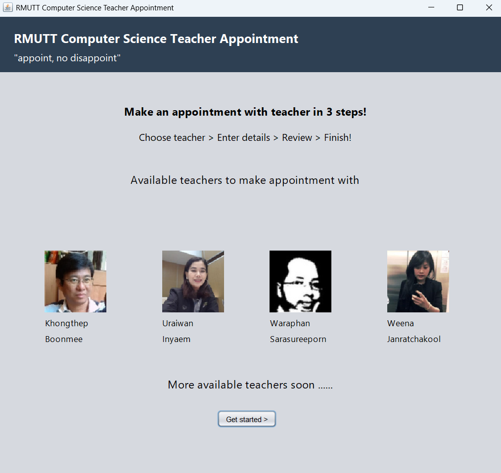
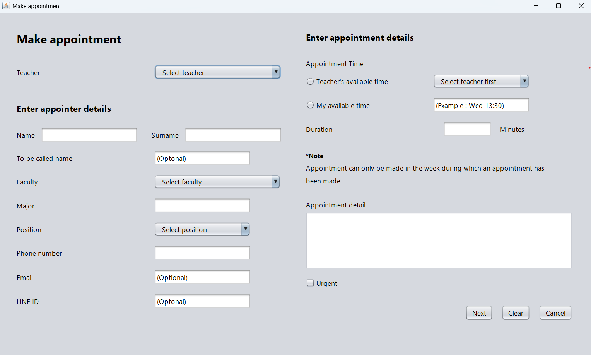
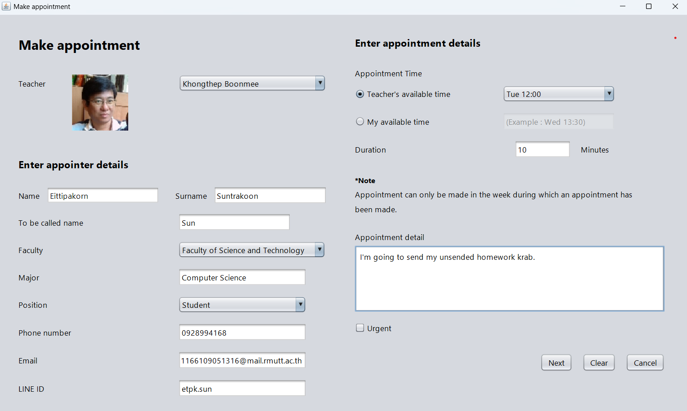
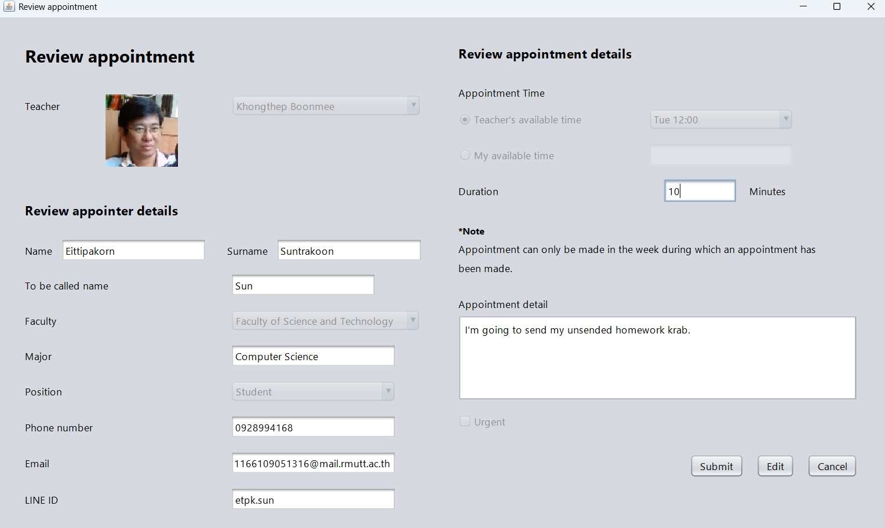
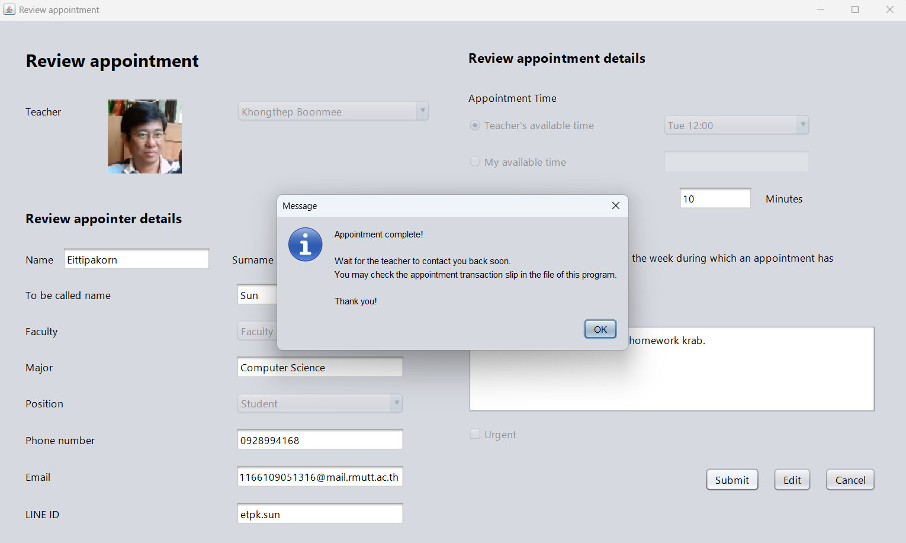
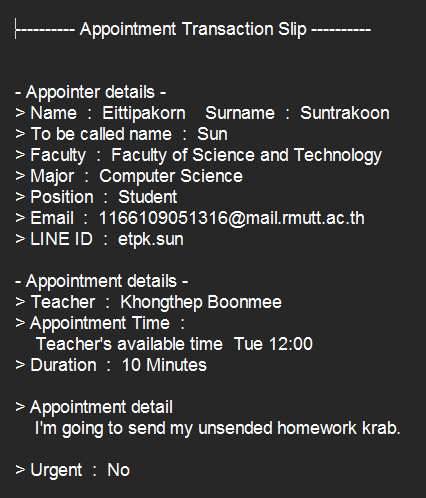

# Teacher Appointment Application

**Subject:** Object-Oriented Programming
**Type:** Individual Project

## Description
An application for scheduling appointments with teachers based on mutual availability. Students can view each teacher’s available time slots, create appointments, and provide meeting details.

The idea was inspired by the difficulty in contacting certain teachers who are often busy or hard to reach.

## Technology
- Using Java Swing in Netbeans

## Screenshots

